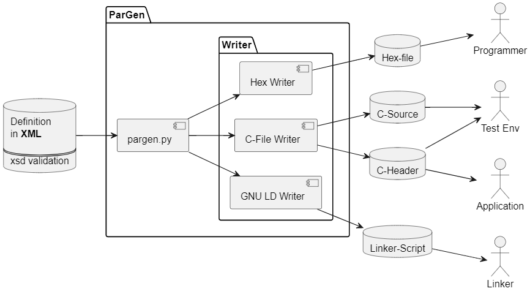

# ParGen - A tool for generating flashable parameter Container

ParGen is a embedded developmen tool for generation of parameters values that
can bestored in flash memory and maintained independent from the application.

## Concept and Planned Features

* Read input from a schema validated XML file
* Generate C-Source stubs for embedding into the application source core
* Generate Intel Hex files for flashing with a programmer
* Generate GNU linker include file for mapping the parameter to absolute addresses
* Generate A2L fragements of accessing the parameters from AUTOSAR test environments

## Installing Python Dependencies

A example ships in the 'example' folder. To run it make sure to have
all dependencies from requirements.txt installed. Run the following inside the
checked out sandbox folder:

### MacOS/Linux

    python3 -m venv .venv
    python3 -m pip install -r requirements.txt
    source .env/bin/activate

### Windows

    python -m venv .venv
    python -m pip install -r requirements.txt
    .venv\Scripts\activate.bat (or Activate.ps1 for powershell)

## Running the Example

Go to the folder example and run the "run.bat" or "run.sh" script. It should create
the following output:

    pargen 0.0.1 : A tool for generating flashable parameter container.
    copyright (c) 2022 haju.schulz@online.de

    Generating intelhex file example.hex
    Generating C-files param.[ch]
    Generating GNU Linker script example.ld
    Done.

The tools parses the example.xml parameter definition and converts it into

* Intel hex files for flashing
* C/H for accessing the parameter in applications (H-File) and unittests (C-File)
* GNU Linker script for generating parameter symbols at the flash adresses

# Issues, Ideas And Bugs

If you have further ideas or you found some bugs, great! Create a [issue](https://github.com/issues) or if you are able and willing to fix it by yourself, clone the repository and create a pull request.

## License

The whole source code is published under the [BSD 3-Clause License](https://opensource.org/licenses/BSD-3-Clause/).
Consider also the different licenses of used third party libraries too!

## Contribution

We welcome contribution, but unless you explicitly state otherwise, any contribution intentionally submitted for inclusion in the work by you, shall be licensed as above, without anyadditional terms or conditions.